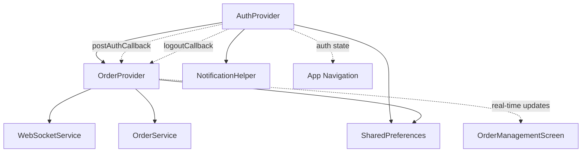

# Flutter Provider State Management - Pinia Architecture Guide

## 📋 Table of Contents
1. [Store Structure Overview](#store-structure-overview)
2. [Core Store Patterns](#core-store-patterns)
3. [State Management Architecture](#state-management-architecture)
4. [Store Dependencies & Communication](#store-dependencies--communication)
5. [Store Lifecycle Management](#store-lifecycle-management)
6. [Best Practices & Patterns](#best-practices--patterns)

---

## 🏪 Store Structure Overview

### Pinia-Style Store Organization

```typescript
// Pinia Store Structure (Reference)
stores/
├── auth.js           // Authentication & user session
├── orders.js         // Order management & real-time updates  
├── notifications.js  // Push notifications & alerts
├── websocket.js      // Real-time connection management
└── ui.js            // UI state & navigation
```

### Flutter Provider Equivalent Structure

```dart
// Flutter Provider Structure (Implementation)
providers/
├── auth_provider.dart         // ≈ stores/auth.js
├── order_provider.dart        // ≈ stores/orders.js  
├── notification_provider.dart // ≈ stores/notifications.js
├── websocket_provider.dart    // ≈ stores/websocket.js
└── navigation_provider.dart   // ≈ stores/ui.js
```

---

## 🏗️ Core Store Patterns

### 1. Authentication Store (auth_provider.dart)

#### Pinia Pattern (Reference)
```javascript
// stores/auth.js
export const useAuthStore = defineStore('auth', {
  state: () => ({
    user: null,
    token: null,
    isLoggedIn: false,
    loading: false,
    error: null,
    storeData: null
  }),
  
  getters: {
    isAuthenticated: (state) => !!state.token,
    userName: (state) => state.user?.name || 'Guest',
    storeId: (state) => state.storeData?.id
  },
  
  actions: {
    async login(credentials) { /* implementation */ },
    async logout() { /* implementation */ },
    async checkAuthStatus() { /* implementation */ }
  }
})
```

#### Flutter Provider Implementation
```dart
// providers/auth_provider.dart
class AuthProvider with ChangeNotifier {
  // === STATE (Pinia state equivalent) ===
  User? _user;
  String? _token; 
  bool _isLoggedIn = false;
  bool _loading = false;
  String? _error;
  StoreData? _storeData;
  AuthState _authState = AuthState.initial;

  // === GETTERS (Pinia getters equivalent) ===
  User? get user => _user;
  String? get token => _token;
  bool get isLoggedIn => _isLoggedIn;
  bool get loading => _loading;
  String? get error => _error;
  StoreData? get storeData => _storeData;
  AuthState get authState => _authState;
  
  // Computed properties (like Pinia getters)
  bool get isAuthenticated => _token != null && _authState == AuthState.authenticated;
  String get userName => _user?.name ?? 'Guest';
  String get storeId => _storeData?.id ?? '';
  String get storeID => _storeData?.internalId ?? '';

  // === ACTIONS (Pinia actions equivalent) ===
  
  /// Login action - equivalent to Pinia action
  Future<bool> login(String storeId) async {
    _setLoading(true);
    _clearError();
    
    try {
      _authState = AuthState.authenticating;
      notifyListeners();

      final ApiResponse response = await _apiClient.authenticateStore(storeId: storeId);
      
      if (response.status == 'success') {
        await _saveAuthData(response.data, storeId);
        await _initializePostAuthServices();
        
        _authState = AuthState.authenticated;
        _isLoggedIn = true;
        notifyListeners();
        
        return true;
      } else {
        _setError(response.message ?? 'Authentication failed');
        return false;
      }
    } catch (e) {
      _setError('Login failed: $e');
      return false;
    } finally {
      _setLoading(false);
    }
  }

  /// Logout action - equivalent to Pinia action
  Future<void> logout() async {
    try {
      // Call logout API
      await _apiClient.logoutStore(
        subEntityId: int.parse(storeID),
        apiToken: _token ?? '',
      );
    } catch (e) {
      log('Error during logout API call: $e');
    }

    // Clear all state
    await _clearAuthData();
    await _cleanupServices();
    
    _resetState();
    notifyListeners();
  }

  /// Check authentication status - equivalent to Pinia action
  Future<void> checkAuthStatus() async {
    final prefs = await SharedPreferences.getInstance();
    final isLoggedIn = prefs.getBool('isLoggedIn') ?? false;
    final storedToken = prefs.getString('apiToken');
    
    if (isLoggedIn && storedToken != null) {
      await _restoreAuthState(prefs);
      _postAuthCallback?.call(storeID);
    } else {
      _authState = AuthState.unauthenticated;
      notifyListeners();
    }
  }

  // === PRIVATE MUTATIONS (Pinia state mutations) ===
  void _setLoading(bool loading) {
    _loading = loading;
    notifyListeners();
  }

  void _setError(String error) {
    _error = error;
    _authState = AuthState.error;
    notifyListeners();
  }

  void _clearError() {
    if (_error != null) {
      _error = null;
      notifyListeners();
    }
  }

  void _resetState() {
    _user = null;
    _token = null;
    _isLoggedIn = false;
    _storeData = null;
    _authState = AuthState.unauthenticated;
    _error = null;
    _loading = false;
  }

  // === SERVICE INTEGRATION (Pinia cross-store actions) ===
  Function(String)? _postAuthCallback;
  VoidCallback? _onLogoutCallback;

  void setPostAuthCallback(Function(String)? callback) {
    _postAuthCallback = callback;
  }

  void setLogoutCallback(VoidCallback? callback) {
    _onLogoutCallback = callback;
  }

  Future<void> _initializePostAuthServices() async {
    // Initialize OneSignal (like calling another Pinia store)
    await NotificationHelper.setExternalUserId(storeID);
    await NotificationHelper.sendTag('store_id', storeID);
    await NotificationHelper.sendTag('store_name', _storeData?.name ?? 'Unknown Store');
  }

  Future<void> _cleanupServices() async {
    // Cleanup OneSignal
    await NotificationHelper.removeExternalUserId();
    await NotificationHelper.removeTag('store_id');
    await NotificationHelper.removeTag('store_name');
    
    // Trigger cleanup in other providers
    _onLogoutCallback?.call();
  }
}
```

### 2. Order Management Store (order_provider.dart)

#### Pinia Pattern (Reference)
```javascript
// stores/orders.js  
export const useOrderStore = defineStore('orders', {
  state: () => ({
    allOrders: [],
    pendingOrders: [],
    activeOrders: [], 
    pastOrders: [],
    selectedOrder: null,
    loading: false,
    error: null,
    connectionStatus: 'disconnected',
    soundEnabled: true
  }),

  getters: {
    totalOrders: (state) => state.allOrders.length,
    ordersByStatus: (state) => (status) => state.allOrders.filter(o => o.status === status),
    isConnected: (state) => state.connectionStatus === 'connected'
  },

  actions: {
    async fetchOrders() { /* implementation */ },
    async updateOrderStatus(id, status) { /* implementation */ },
    initializeWebSocket(storeId) { /* implementation */ },
    handleRealtimeUpdate(data) { /* implementation */ }
  }
})
```

#### Flutter Provider Implementation
```dart
// providers/order_provider.dart
class OrderProvider with ChangeNotifier {
  // === STATE (Pinia state equivalent) ===
  List<FainzyUserOrder> _allOrders = [];
  List<FainzyUserOrder> _pendingOrders = [];
  List<FainzyUserOrder> _activeOrders = [];
  List<FainzyUserOrder> _pastOrders = [];
  FainzyUserOrder? _selectedOrder;
  OrderStatistics? _orderStatistics;
  
  OrderStatus _status = OrderStatus.initial;
  OrderActionStatus _actionStatus = OrderActionStatus.idle;
  String? _error;
  
  // WebSocket state
  String _connectionStatus = 'Disconnected';
  bool _isWebsocketInitialized = false;
  bool _soundNotificationsEnabled = true;

  // === GETTERS (Pinia getters equivalent) ===
  List<FainzyUserOrder> get allOrders => _allOrders;
  List<FainzyUserOrder> get pendingOrders => _pendingOrders;
  List<FainzyUserOrder> get activeOrders => _activeOrders;
  List<FainzyUserOrder> get pastOrders => _pastOrders;
  FainzyUserOrder? get selectedOrder => _selectedOrder;
  OrderStatistics? get orderStatistics => _orderStatistics;
  
  OrderStatus get status => _status;
  OrderActionStatus get actionStatus => _actionStatus;
  String? get error => _error;
  String get connectionStatus => _connectionStatus;
  
  // Computed properties (Pinia getters)
  bool get isLoading => _status == OrderStatus.loading;
  bool get isUpdating => _actionStatus == OrderActionStatus.updating;
  bool get hasError => _status == OrderStatus.error;
  bool get hasOrders => _allOrders.isNotEmpty;
  bool get isWebsocketConnected => _isWebsocketInitialized;
  bool get soundNotificationsEnabled => _soundNotificationsEnabled;
  int get totalOrders => _allOrders.length;

  // Dynamic getters (like Pinia parameterized getters)
  List<FainzyUserOrder> getOrdersByStatus(String status) {
    return _allOrders.where((order) => order.status == status).toList();
  }

  int getOrderCountByStatus(String status) {
    return getOrdersByStatus(status).length;
  }

  // === ACTIONS (Pinia actions equivalent) ===

  /// Fetch orders action - equivalent to Pinia action
  Future<void> fetchOrders([int? subentityId, String? filter]) async {
    try {
      _setStatus(OrderStatus.loading);
      _clearError();

      int? effectiveSubentityId = subentityId ?? await _orderService.getSubentityId();
      if (effectiveSubentityId == null) {
        throw Exception('No subentity ID found');
      }

      log('OrderProvider: Fetching orders for subentity $effectiveSubentityId...');
      final orders = await _orderService.fetchOrders(effectiveSubentityId, filter);
      
      _allOrders = orders;
      _categorizeOrders();
      
      _setStatus(OrderStatus.success);
      log('OrderProvider: Successfully fetched ${orders.length} orders');
    } catch (e) {
      log('OrderProvider: Error fetching orders - $e');
      _setError('Failed to fetch orders: $e');
      _setStatus(OrderStatus.error);
    }
  }

  /// Update order status action - equivalent to Pinia action
  Future<void> updateOrderStatus({required int orderId, required String status}) async {
    try {
      _setActionStatus(OrderActionStatus.updating);
      _clearError();

      log('OrderProvider: Updating order $orderId status to $status...');
      await _orderService.updateOrderStatus(orderId: orderId, status: status);
      
      _updateOrderInLists(orderId, status);
      
      _setActionStatus(OrderActionStatus.idle);
      log('OrderProvider: Successfully updated order $orderId status to $status');
    } catch (e) {
      log('OrderProvider: Error updating order $orderId status - $e');
      _setError('Failed to update order status: $e');
      _setActionStatus(OrderActionStatus.idle);
    }
  }

  /// Initialize WebSocket - equivalent to Pinia action
  void initializeWebsocket(String storeID) {
    if (_isWebsocketInitialized || storeID.isEmpty) return;
    
    try {
      log('OrderProvider: Initializing websocket for store ID: $storeID...');
      
      final wsUrl = 'wss://your-websocket-server.com/stores/$storeID/orders';
      _webSocketService.connect(wsUrl);
      _subscribeToOrderUpdates();
      _subscribeToConnectionStatus();
      _isWebsocketInitialized = true;
      
      log('OrderProvider: Websocket initialized successfully for store ID: $storeID');
    } catch (e) {
      log('OrderProvider: Error initializing websocket - $e');
    }
  }

  /// Handle real-time updates - equivalent to Pinia action
  void _handleWebsocketOrderUpdate(Map<String, dynamic> orderData) {
    try {
      log('OrderProvider: Processing websocket order data: $orderData');
      
      final eventType = orderData['type'] ?? orderData['event_type'] ?? 'order_update';
      log('OrderProvider: Websocket event type: $eventType');
      
      if (eventType == 'order_notification' || eventType == 'new_order') {
        _playNewOrderSound();
        _refreshOrdersFromWebsocket();
        return;
      }
      
      final updatedOrder = FainzyUserOrder.fromJson(orderData);
      if (updatedOrder.id == null) return;

      final existingOrderIndex = _allOrders.indexWhere((order) => order.id == updatedOrder.id);
      
      if (existingOrderIndex >= 0) {
        _allOrders[existingOrderIndex] = updatedOrder;
        if (_selectedOrder?.id == updatedOrder.id) {
          _selectedOrder = updatedOrder;
        }
      } else {
        _allOrders.insert(0, updatedOrder);
        _playNewOrderSound();
      }
      
      _categorizeOrders();
      notifyListeners();
      
    } catch (e) {
      log('OrderProvider: Error processing websocket order update - $e');
      _refreshOrdersFromWebsocket();
    }
  }

  /// Toggle sound notifications - equivalent to Pinia action
  void setSoundNotifications(bool enabled) {
    _soundNotificationsEnabled = enabled;
    notifyListeners();
  }

  /// Clear all data - equivalent to Pinia reset action
  void clearData() {
    _allOrders.clear();
    _pendingOrders.clear();
    _activeOrders.clear();
    _pastOrders.clear();
    _selectedOrder = null;
    _orderStatistics = null;
    _setStatus(OrderStatus.initial);
    _clearError();
    
    disconnectWebsocket();
  }

  // === PRIVATE MUTATIONS (Pinia state mutations) ===
  void _setStatus(OrderStatus status) {
    if (_status != status) {
      _status = status;
      notifyListeners();
    }
  }

  void _setActionStatus(OrderActionStatus actionStatus) {
    if (_actionStatus != actionStatus) {
      _actionStatus = actionStatus;
      notifyListeners();
    }
  }

  void _setError(String error) {
    _error = error;
    notifyListeners();
  }

  void _clearError() {
    if (_error != null) {
      _error = null;
      notifyListeners();
    }
  }

  void _categorizeOrders() {
    _pendingOrders = _allOrders.where((order) => order.status == 'pending').toList();
    _pastOrders = _allOrders.where((order) => 
      order.status == 'completed' || 
      order.status == 'rejected' || 
      order.status == 'cancelled'
    ).toList();
    _activeOrders = _allOrders.where((order) => 
      order.status != 'pending' &&
      order.status != 'completed' && 
      order.status != 'rejected' && 
      order.status != 'cancelled'
    ).toList();
    
    log('OrderProvider: Categorized orders - Pending: ${_pendingOrders.length}, Active: ${_activeOrders.length}, Past: ${_pastOrders.length}');
  }

  // === CLEANUP (Pinia lifecycle equivalent) ===
  @override
  void dispose() {
    _orderStreamSubscription?.cancel();
    _connectionStatusSubscription?.cancel();
    _webSocketService.disconnect();
    super.dispose();
  }
}
```

### 3. Notification Store (notification_helper.dart)

#### Pinia Pattern (Reference)
```javascript
// stores/notifications.js
export const useNotificationStore = defineStore('notifications', {
  state: () => ({
    permissions: false,
    playerId: null,
    tags: {},
    initialized: false
  }),

  actions: {
    async initialize() { /* implementation */ },
    async setUserId(userId) { /* implementation */ },
    async addTag(key, value) { /* implementation */ }
  }
})
```

#### Flutter Service Implementation (Static Pattern)
```dart
// helpers/notification_helper.dart (Static Service Pattern)
class NotificationHelper {
  // === STATIC STATE (Service singleton pattern) ===
  static bool _initialized = false;
  static String? _playerId;
  static Map<String, String> _tags = {};

  // === GETTERS (Service state access) ===
  static bool get initialized => _initialized;
  static String? get playerId => _playerId;
  static Map<String, String> get tags => Map.from(_tags);

  // === ACTIONS (Service methods equivalent to Pinia actions) ===

  /// Initialize OneSignal - equivalent to Pinia action
  static Future<void> initialize() async {
    if (_initialized) return;
    
    try {
      OneSignal.Debug.setLogLevel(OSLogLevel.verbose);
      OneSignal.initialize(_appId);

      await OneSignal.Notifications.requestPermission(true);

      OneSignal.Notifications.addForegroundWillDisplayListener(_onForegroundWillDisplay);
      OneSignal.Notifications.addClickListener(_onNotificationClicked);

      _playerId = await getPlayerId();
      _initialized = true;

      if (kDebugMode) {
        print('OneSignal initialized successfully');
      }
    } catch (e) {
      if (kDebugMode) {
        print('Failed to initialize OneSignal: $e');
      }
    }
  }

  /// Set external user ID - equivalent to Pinia action
  static Future<void> setExternalUserId(String? userId) async {
    if (userId == null || userId.isEmpty) return;
    
    try {
      await OneSignal.login(userId);
      if (kDebugMode) {
        print('OneSignal external user ID set: $userId');
      }
    } catch (e) {
      if (kDebugMode) {
        print('Failed to set OneSignal external user ID: $e');
      }
    }
  }

  /// Add tag - equivalent to Pinia action  
  static Future<void> sendTag(String key, String value) async {
    try {
      await OneSignal.User.addTags({key: value});
      _tags[key] = value;
      
      if (kDebugMode) {
        print('OneSignal tag sent: $key = $value');
      }
    } catch (e) {
      if (kDebugMode) {
        print('Failed to send OneSignal tag: $e');
      }
    }
  }

  /// Remove tag - equivalent to Pinia action
  static Future<void> removeTag(String key) async {
    try {
      await OneSignal.User.removeTags([key]);
      _tags.remove(key);
      
      if (kDebugMode) {
        print('OneSignal tag removed: $key');
      }
    } catch (e) {
      if (kDebugMode) {
        print('Failed to remove OneSignal tag: $e');
      }
    }
  }

  /// Cleanup - equivalent to Pinia reset action
  static Future<void> removeExternalUserId() async {
    try {
      await OneSignal.logout();
      _tags.clear();
      
      if (kDebugMode) {
        print('OneSignal external user ID removed');
      }
    } catch (e) {
      if (kDebugMode) {
        print('Failed to remove OneSignal external user ID: $e');
      }
    }
  }

  // === EVENT HANDLERS (Service event management) ===
  static void _onForegroundWillDisplay(OSNotificationWillDisplayEvent event) {
    if (kDebugMode) {
      print('Foreground notification received: ${event.notification.title}');
    }
  }

  static void _onNotificationClicked(OSNotificationClickEvent event) {
    final notification = event.notification;
    
    if (kDebugMode) {
      print('Notification clicked: ${notification.title}');
    }

    _handleNotificationNavigation(notification.additionalData);
  }

  static void _handleNotificationNavigation(Map<String, dynamic>? data) {
    if (data == null) return;

    final String? type = data['type'] as String?;
    final String? orderId = data['order_id'] as String?;

    switch (type) {
      case 'new_order':
        if (kDebugMode) print('New order notification: $orderId');
        break;
      case 'order_update':
        if (kDebugMode) print('Order update notification: $orderId');
        break;
      default:
        if (kDebugMode) print('Unknown notification type: $type');
    }
  }
}
```

---

## 🔄 State Management Architecture

### Store Dependency Graph



### Store Communication Patterns

#### 1. Cross-Store Communication (Pinia $patch equivalent)

```dart
// In AuthProvider - calling other stores/services
class AuthProvider with ChangeNotifier {
  Future<void> login(String storeId) async {
    // ... authentication logic
    
    if (success) {
      // Cross-store communication (like Pinia store calls)
      await NotificationHelper.setExternalUserId(_storeID);
      await NotificationHelper.sendTag('store_id', _storeID);
      
      // Trigger other provider initialization
      _postAuthCallback?.call(_storeID); // -> OrderProvider.initializeWebsocket()
    }
  }

  Future<void> logout() async {
    // Cross-store cleanup
    await NotificationHelper.removeExternalUserId();
    _onLogoutCallback?.call(); // -> OrderProvider.clearData()
    
    // Reset local state
    _resetState();
    notifyListeners();
  }
}
```

#### 2. Store Subscription Pattern (Pinia $subscribe equivalent)

```dart
// In OrderProvider - subscribing to external services
class OrderProvider with ChangeNotifier {
  StreamSubscription<Map<String, dynamic>>? _orderStreamSubscription;
  StreamSubscription<String>? _connectionStatusSubscription;

  void initializeWebsocket(String storeID) {
    // Subscribe to WebSocket updates (like Pinia $subscribe)
    _orderStreamSubscription = _webSocketService.orderUpdates.listen(
      (orderData) {
        _handleWebsocketOrderUpdate(orderData);
      },
      onError: (error) {
        log('Websocket order stream error - $error');
      },
    );
    
    // Subscribe to connection status
    _connectionStatusSubscription = _webSocketService.connectionStatus.listen(
      (status) {
        _connectionStatus = status;
        notifyListeners();
      },
    );
  }
}
```

### Store Lifecycle Management

#### Provider Registration (Pinia equivalent)

```dart
// main.dart - Store registration (like Pinia createPinia())
void main() async {
  WidgetsFlutterBinding.ensureInitialized();
  
  // Initialize services (like Nuxt plugins)
  await NotificationHelper.initialize();
  
  runApp(
    MultiProvider(
      providers: [
        // Register stores (like Pinia store definitions)
        ChangeNotifierProvider(create: (_) => AuthProvider()),
        ChangeNotifierProvider(create: (_) => OrderProvider()),
        ChangeNotifierProvider(create: (_) => StoreProvider()),
        ChangeNotifierProvider(create: (_) => MenuProvider()),
        ChangeNotifierProvider(create: (_) => NavigationProvider()),
      ],
      child: AppWithWebsocketListener(),
    ),
  );
}
```

#### Store Initialization Chain

```dart
// App-level store setup (like Pinia auto-initialization)
class AppWithWebsocketListener extends StatefulWidget {
  @override
  State<AppWithWebsocketListener> createState() => _AppWithWebsocketListenerState();
}

class _AppWithWebsocketListenerState extends State<AppWithWebsocketListener> {
  @override
  void initState() {
    super.initState();
    
    WidgetsBinding.instance.addPostFrameCallback((_) {
      final authProvider = Provider.of<AuthProvider>(context, listen: false);
      final orderProvider = Provider.of<OrderProvider>(context, listen: false);
      
      // Setup cross-store communication (like Pinia store composition)
      authProvider.setPostAuthCallback((storeID) {
        orderProvider.initializeWebsocket(storeID);
      });
      
      authProvider.setLogoutCallback(() {
        orderProvider.clearData();
      });
      
      // Auto-login check (like Pinia auto-hydration)
      if (authProvider.isLoggedIn && authProvider.storeID.isNotEmpty) {
        orderProvider.initializeWebsocket(authProvider.storeID);
      }
    });
  }
}
```

---

## 🔌 Store Dependencies & Communication

### 1. Service Injection Pattern

```dart
// Service layer (like Pinia plugins)
class OrderProvider with ChangeNotifier {
  // Dependency injection (like Pinia service composition)
  final OrderService _orderService = OrderService(FainzyApiClient(), LastMileApiClient());
  final WebSocketService _webSocketService = WebSocketService();
  
  // Service state (like composable state)
  StreamSubscription<Map<String, dynamic>>? _orderStreamSubscription;
  StreamSubscription<String>? _connectionStatusSubscription;
}
```

### 2. Store Composition Pattern

```dart
// Cross-store data access (like Pinia store composition)
class OrderManagementScreen extends StatefulWidget {
  @override
  Widget build(BuildContext context) {
    return MultiProvider(
      providers: [
        // Compose multiple stores (like using multiple Pinia stores)
        Consumer<AuthProvider>(
          builder: (context, authProvider, child) {
            return Consumer<OrderProvider>(
              builder: (context, orderProvider, child) {
                // Access multiple store states (like Pinia composition)
                if (!authProvider.isAuthenticated) {
                  return LoginScreen();
                }
                
                return OrderListWidget(
                  orders: orderProvider.allOrders,
                  connectionStatus: orderProvider.connectionStatus,
                  userName: authProvider.userName,
                );
              },
            );
          },
        ),
      ],
    );
  }
}
```

### 3. Store State Derivation

```dart
// Computed state patterns (like Pinia getters)
class OrderProvider with ChangeNotifier {
  // Base state
  List<FainzyUserOrder> _allOrders = [];
  
  // Derived state (like Pinia getters)
  List<FainzyUserOrder> get pendingOrders => 
    _allOrders.where((order) => order.status == 'pending').toList();
    
  List<FainzyUserOrder> get activeOrders => 
    _allOrders.where((order) => 
      order.status != 'pending' &&
      order.status != 'completed' && 
      order.status != 'rejected' && 
      order.status != 'cancelled'
    ).toList();
    
  List<FainzyUserOrder> get pastOrders => 
    _allOrders.where((order) => 
      order.status == 'completed' || 
      order.status == 'rejected' || 
      order.status == 'cancelled'
    ).toList();
  
  // Parameterized getters (like Pinia parameterized getters)
  List<FainzyUserOrder> getOrdersByStatus(String status) {
    return _allOrders.where((order) => order.status == status).toList();
  }
  
  int get totalOrders => _allOrders.length;
  bool get hasOrders => _allOrders.isNotEmpty;
  
  // Computed loading states
  bool get isLoading => _status == OrderStatus.loading;
  bool get hasError => _status == OrderStatus.error;
}
```

---

## 📋 Best Practices & Patterns

### 1. State Immutability (Pinia best practices)

```dart
// DON'T: Mutate state directly
void badUpdateOrder(FainzyUserOrder updatedOrder) {
  _allOrders.firstWhere((o) => o.id == updatedOrder.id).status = updatedOrder.status;
  notifyListeners(); // This won't trigger proper updates
}

// DO: Replace state immutably
void goodUpdateOrder(FainzyUserOrder updatedOrder) {
  final index = _allOrders.indexWhere((o) => o.id == updatedOrder.id);
  if (index >= 0) {
    _allOrders[index] = updatedOrder; // Replace entire object
    _categorizeOrders(); // Recalculate derived state
    notifyListeners(); // Trigger UI updates
  }
}
```

### 2. Error State Management (Pinia error handling)

```dart
class OrderProvider with ChangeNotifier {
  String? _error;
  OrderStatus _status = OrderStatus.initial;
  
  // Error state getters (like Pinia error getters)
  String? get error => _error;
  bool get hasError => _status == OrderStatus.error;
  
  // Error handling actions (like Pinia error actions)
  void _setError(String error) {
    _error = error;
    _status = OrderStatus.error;
    notifyListeners();
  }
  
  void _clearError() {
    if (_error != null) {
      _error = null;
      notifyListeners();
    }
  }
  
  // Retry mechanism (like Pinia retry actions)
  Future<void> retryLastAction() async {
    _clearError();
    await fetchOrders(); // Retry the failed action
  }
}
```

### 3. Loading State Patterns (Pinia loading states)

```dart
class AuthProvider with ChangeNotifier {
  bool _loading = false;
  AuthState _authState = AuthState.initial;
  
  // Loading state getters (like Pinia loading getters)
  bool get loading => _loading;
  bool get isAuthenticating => _authState == AuthState.authenticating;
  
  // Loading state management (like Pinia loading actions)
  Future<bool> login(String storeId) async {
    _setLoading(true);
    
    try {
      _authState = AuthState.authenticating;
      notifyListeners();
      
      // ... API call
      
      _authState = AuthState.authenticated;
      return true;
    } catch (e) {
      _authState = AuthState.error;
      return false;
    } finally {
      _setLoading(false);
    }
  }
  
  void _setLoading(bool loading) {
    _loading = loading;
    notifyListeners();
  }
}
```

### 4. Store Reset Patterns (Pinia $reset equivalent)

```dart
class OrderProvider with ChangeNotifier {
  // Store reset action (like Pinia $reset)
  void clearData() {
    // Reset all state to initial values
    _allOrders.clear();
    _pendingOrders.clear();
    _activeOrders.clear();
    _pastOrders.clear();
    _selectedOrder = null;
    _orderStatistics = null;
    _status = OrderStatus.initial;
    _actionStatus = OrderActionStatus.idle;
    _error = null;
    _connectionStatus = 'Disconnected';
    _isWebsocketInitialized = false;
    
    // Clean up resources
    disconnectWebsocket();
    
    notifyListeners();
  }
}
```

### 5. Store Composition & Modularity

```dart
// Modular store composition (like Pinia store composition)
class StoreManager {
  static void setupStoreCallbacks(BuildContext context) {
    final authProvider = Provider.of<AuthProvider>(context, listen: false);
    final orderProvider = Provider.of<OrderProvider>(context, listen: false);
    final storeProvider = Provider.of<StoreProvider>(context, listen: false);
    
    // Auth -> Order communication
    authProvider.setPostAuthCallback((storeID) {
      orderProvider.initializeWebsocket(storeID);
      storeProvider.loadStoreData(storeID);
    });
    
    // Auth -> All stores cleanup
    authProvider.setLogoutCallback(() {
      orderProvider.clearData();
      storeProvider.clearData();
    });
  }
}
```

This architecture provides the same developer experience as Pinia with:
- **Reactive state management** through `notifyListeners()`
- **Computed properties** through getters
- **Actions** through async methods
- **Cross-store communication** through callbacks and service injection
- **Type safety** through Dart's type system
- **Developer tools** through Flutter's widget inspector and debugging tools

The key difference is that Flutter uses the Observer pattern with `ChangeNotifier` instead of Vue's reactivity system, but the mental model and organization patterns remain very similar to Pinia stores.
